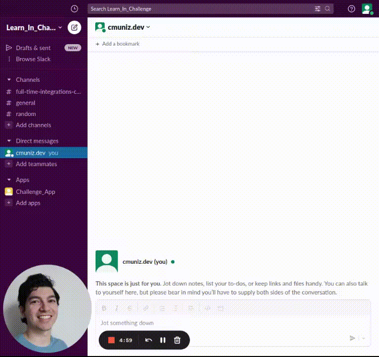
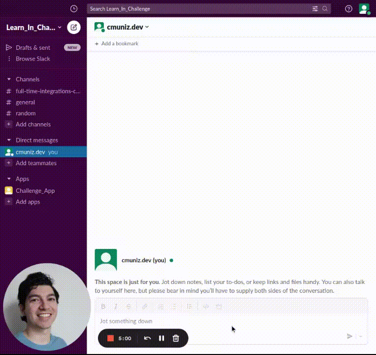

# Slack Integration Interview Challenge

`/randomx2`

`/relatednames`

## Challenge Instructions
See [Full-Time Integrations Challenge.pdf](full-time_integrations_challenge.pdf) for more details.

## Installation

### Python Setup
Using `python 3.10`, create a virtual environment with:

    python -m venv .venv

Activate the virtual environment

    source .venv/bin/activate

And then install requirements with:

    pip install -r requirements/base.txt

### Slack Integration
#### Create a Slack app
Navigate to the [slack api apps page](https://api.slack.com/apps).
Click the button to create a new app.
Choose "from scratch" and name your app.

#### Add OAuth Scopes under Bot Token Scopes
From the [slack api apps page](https://api.slack.com/apps), click on the app you just
made.
Using the left navigation bar, choose OAuth & Permissions.
Scroll down to Scopes.
Within Bot Token Scopes choose the following:
- channels:history
- channels:read
- chat:write
- commands
- groups:history
- groups:read
- im:history
- im:read
- mpim:history
- mpim:read
- users:read

#### Install App to Workspace
Scroll up to the top of the OAuth & Permissions page and click Install App to Workspace.

#### Copy Bot User OAuth Access Token
Once the installation is authorized, on the OAuth & Permissions page, you will see a Bot
User OAuth Access Token.
Save this Bot User OAuth Access token for later.

#### Generate app-level token
Using the left navigation bar, choose Basic Information page.
Scroll to the bottom of this page to App-Level Tokens.
Generate a new token with the scope `connections:write`.
Save this app-level token for later.

#### Enable Socket Mode
Using the left navigation bar, choose Socket Mode.
Under the Connect using Socket Mode, click the slider to enable Socket Mode.

#### Export Tokens:
In a terminal export the tokens generated above
    
    export SLACK_BOT_TOKEN=xoxb-<your-bot-token>
    export SLACK_APP_TOKEN=<your-app-level-token>

#### Create slack slash commands
Using the left navigation bar, choose Slash Commands.
On this page, you will be creating two new commands.
Select Create New Command.
Name the first one `/randomx2` and the second `/relatednames`

### Behind the Name API
#### Create an account
At the top of the [API Documentation page](https://www.behindthename.com/api/help.php) of behindthename.com, click the [API Gateway](https://www.behindthename.com/api/gateway.php).
Create an account and then verify the account.

#### Claim your API Gateway key
Use the [API Gateway](https://www.behindthename.com/api/gateway.php) to generate the API Gateway key.
Save this API Gateway Key for later.

#### Export API Gateway key
In a terminal export the tokens generated above

    export NAME_API_KEY=<your-API-Gateway-key>

## Running

In the terminal with the virtual environment activated:

    python app.py

In any slack channel that the bot is part of use the commands:
- `/randomx2` to return 10 messages. The 10 messages come from a randomly selected channel which a randomly selected user is a member of.
- `/relatednames <name>` to return a list of names related to the input name.
